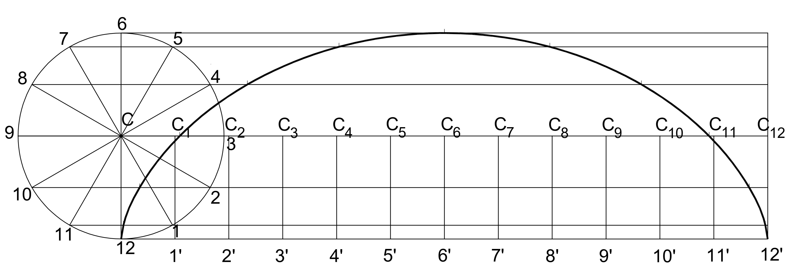
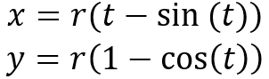
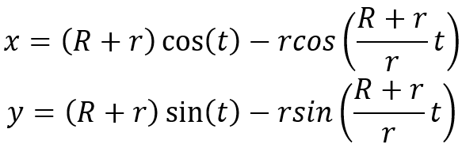
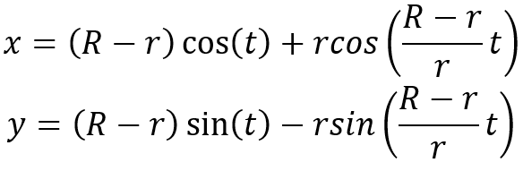
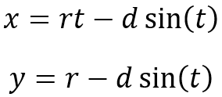
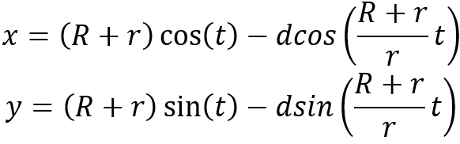
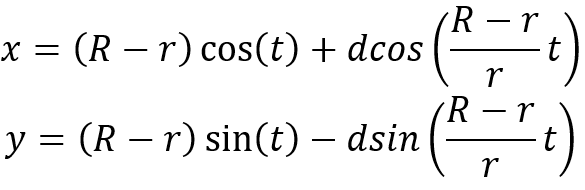

### Theory-

When a fixed point on the circumference of a circle, rolls along a specified straight or curved path, a curve is obtained which is known as a special curve. Curves play a pivotal role in engineering drawing, providing intricate details and precise specifications for various objects. They are fundamental elements that define the form, function, and aesthetics of engineered structures and components. There are six common types of curves extensively utilized in engineering practice.
1. Conic sections 
2. Cycloidal curves 
3. Involute 
4. Evolutes 
5. Spirals 
6. Helix

#### Cycloidal Curves
Cycloidal curves are traced by a point on the circumference of a circle as it rolls along a straight line without slipping. This includes-

**1. Cycloid:** A curve traced by a point on the circumference of a circle as it rolls along a straight line without slipping.

  

_Equation of Cycloid-_ If the circle has a radius r, and its center moves along the x-axis, then the parametric equations of the cycloid are:

  

where t is a parameter that varies, typically representing the angle of rotation.  
 

**2. Epicycloid:** A curve traced by a point on the circumference of a circle as it rolls along the outside of another circle.

  

_Equation of Epicycloid-_ 
The parametric equations for an epicycloid, where the rolling circle has radius r and the fixed circle has radius R are:

  

Where t is a parameter that varies, typically representing the angle of rotation. 
 

**3. Hypocycloid:** A curve traced by a point on the circumference of a circle as it rolls along the inside of another circle.

  

_Equation of Hypocycloid-_
The parametric equations for a hypocycloid, where the rolling circle has radius r and the fixed circle has radius R, are:

  

Where t is a parameter that varies, typically representing the angle of rotation. 
 

**4. Trochoid:** Trochoid is defined as the locus of a point on the interior of a circular disc which rolls without slipping on a fixed circle.
_Equation of Trochoid-_
If a point on a circle of radius r is at a distance d from the centre of the circle, and the circle rolls along the x-axis, the parametric equations for the trochoid are:

  

Where t is a parameter that varies, typically representing the angle of rotation. 
 

**5. Epitrochoid:** The locus of a point on the interior of a circular disc which rolls outside of a fixed circle along the circumference.

  

_Equation of Epitrochoid-_
If the fixed circle has a radius R, the rolling circle has a radius r and the point is at a distance from the centre of the rolling circle, the parametric equations of the epitrochoid are:

Where t is a parameter that varies, typically representing the angle of rotation. 
 

**6. Hypotrochoid:** The locus of a point on the interior of a circular disc which rolls inside of a fixed circle along the circumference.

  

_Equation of Hypotrochoid-_
If the fixed circle has a radius R, the rolling circle has a radius r, and the point is at a distance  d from the center of the rolling circle, the parametric equations of the hypotrochoid are:

Where t is a parameter that varies, typically representing the angle of rotation. 
 

#### Applications: 
Cycloidal curves are used in gear design to ensure smooth motion transmission and in cam mechanisms for controlled linear or rotational motion.
